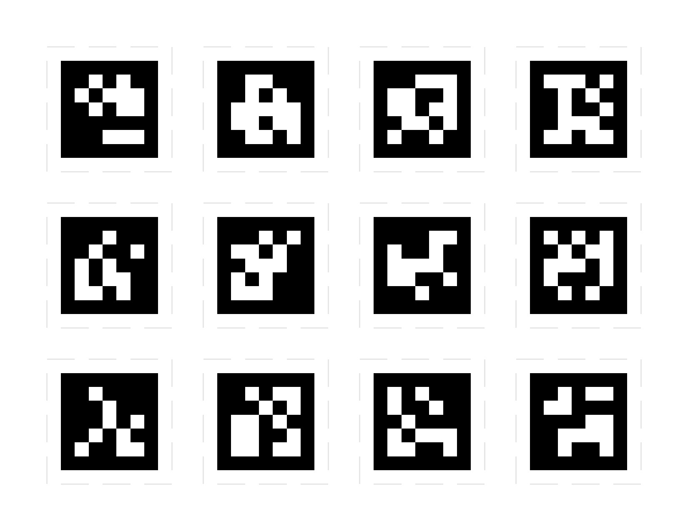

Very brief utility to create a PDF contaiing a regular grid of Apriltags.

Designed for printing sheets of Apriltag labels but could also be used for making calibration boards.   Note this code _does not_ draw the black squares between Apriltags, so it does not make valid Kalibr boards.



# Installation

`apriltag-imgs` is included as a submodule.  Either:

```
git clone --recursive https://github.com/amarburg/draw_apriltag_grid.git
```

or after checkout:

```
git submodule init
git submodule update
```

Then

```
pip install -e .
```

# Usage

```
make-apriltag-sheet  output.pdf
```

Most configuration is still hard coded, this can be improved going forward.

# License

This code is released under the MIT license
